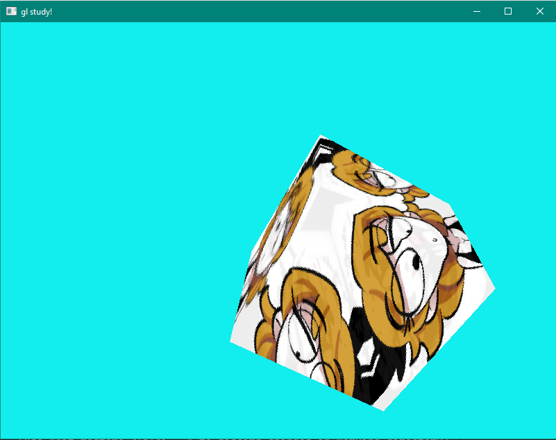
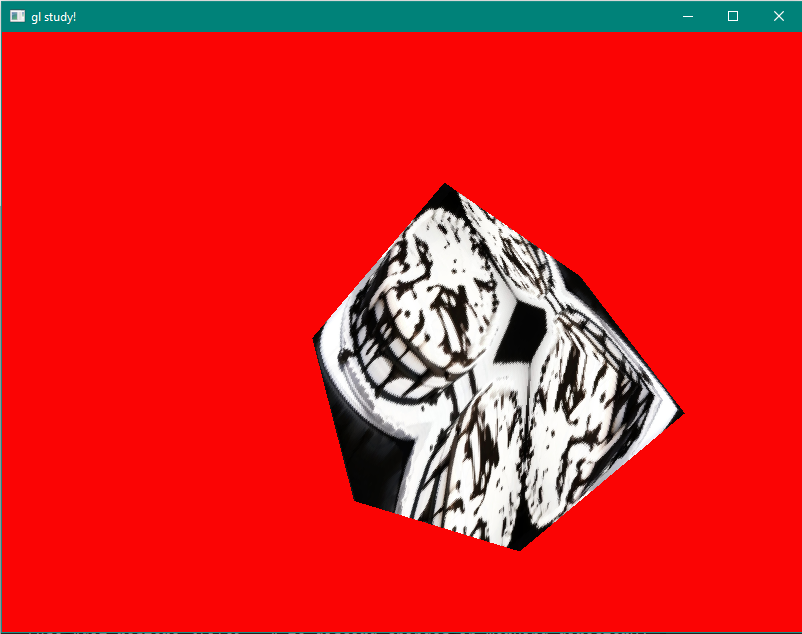

# gl-study
This repository is meant for learning the OpenGL API.

## Objectives:
### Achieved:
- Render a rotating cube.
### Pending:
- Render a rotating cube with different textures on each face.
- Abstract the graphics pipeline.

## Previews:

